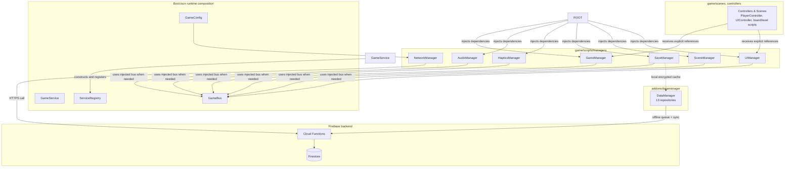
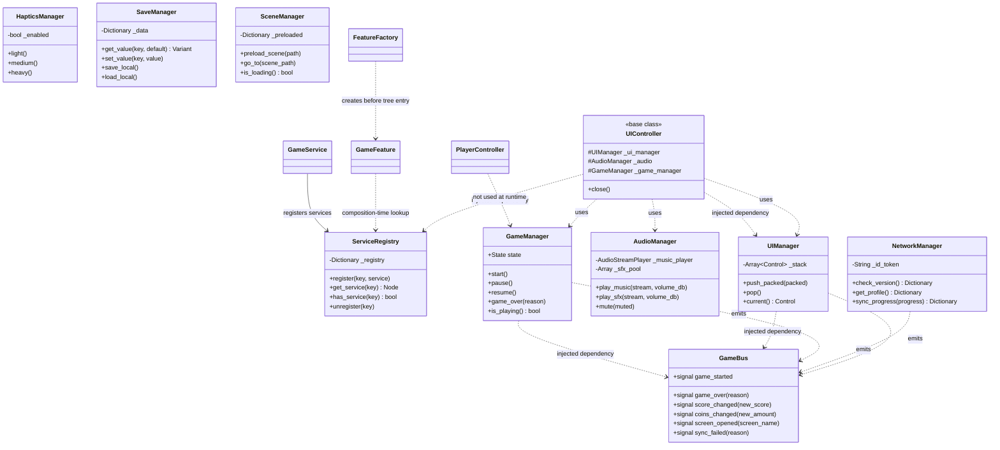
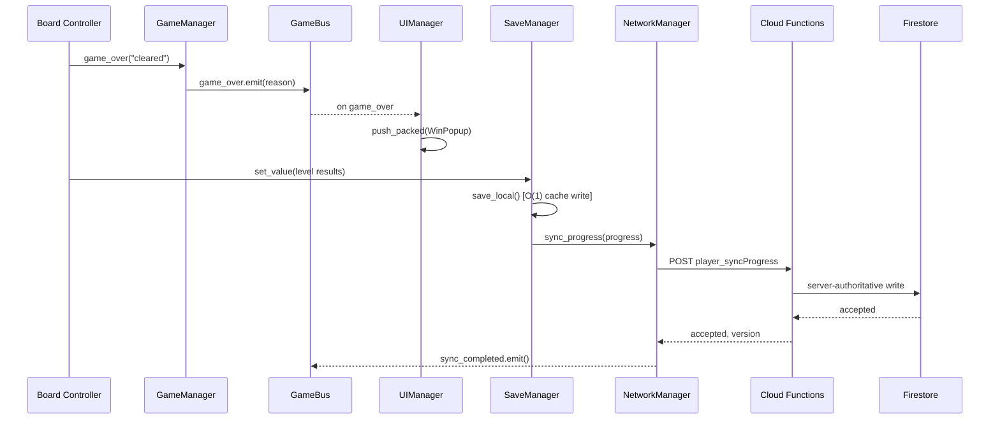

# Godot Game Template

A beginner-friendly Godot 4.7 starting point for building a 2D game. The template provides a working boot scene, shared game services, dependency injection for controllers, local player-data persistence, optional UI/scene managers, and an unfinished Firebase backend scaffold.

> **Important:** This README describes the code that currently exists in this repository. Treat the **Current runtime** section as the source of truth. Other documentation files may describe future integrations and should be checked against the current code before use.

## Quick start

1. Install Godot 4.7 or a compatible Godot 4.x version.
2. Open the project folder in Godot.
3. Press **Play**. The project starts at `game/scenes/boot/Boot.tscn`.
4. Boot creates `GameService`, initializes the managers, and loads `game/scenes/Home/Home.tscn`.
5. Start your game by adding content under `game/scenes/gameplay/` and assets under `game/assets/`.

The current `GameConfig.BUILD_STAGE` is `PROTOTYPE`. In this stage, `NetworkManager` returns mock data for its supported calls and the project is intended to work locally.

## Current runtime architecture

The project has one real Godot autoload:

| Autoload | Purpose |
|---|---|
| `ServiceRegistry` | Stores services after the application has created them |

`Boot.tscn` contains a `GameService` node. `GameService` is the **composition root**: it creates the other services, configures them, adds them to the tree, and registers them in `ServiceRegistry`. The managers are not configured as separate project autoloads.

The startup flow is:

```text
project.godot
  -> ServiceRegistry autoload
  -> Boot.tscn
  -> GameService creates services
  -> services are registered
  -> SceneManager loads Home.tscn
```

## The most important beginner rule

Do not create a new global autoload for every system. Add a manager to `GameService`, configure it there, and register it only if it is a shared application service.

For normal gameplay code, prefer receiving a dependency through an injection method or feature initialization. The registry is mainly for bootstrap/composition code. Existing starter scenes may use the registry to obtain a service, but new reusable gameplay code should not depend on `/root/...` paths.

## Services currently provided

`GameService` creates these services:

| Service | Use it for |
|---|---|
| `GameManager` | Start, pause, resume and finish a game |
| `AudioManager` | Music and sound effects |
| `HapticsManager` | Mobile vibration feedback |
| `SaveManager` | Player progress, currency and local saves |
| `SceneManager` | Loading and changing scenes |
| `UIManager` | Stack-based popup/panel management |
| `NetworkManager` | Firebase Cloud Function HTTP calls; mocked in Prototype |
| `GameBus` | Signals/events between systems |
| `Logger` | Debug, info, warning and error logging |
| `GameConfig` | Build stage, URLs and feature flags |

`BackendService.gd` exists as a backend integration placeholder. It is not currently configured as a project autoload and its Firebase, analytics, ads and Meta methods are stubs.

## Do I need FeatureFactory?

Usually, **no—not at the beginning**. FeatureFactory is an optional helper for creating a feature at runtime and giving it dependencies before adding it to the scene tree.

Use it when you dynamically create a `GameFeature` or controller in code:

```gdscript Level.gd
var flow := FeatureFactory.create_feature(
	GameFlowFeature,
	self,
	{"game": game_manager}
) as GameFlowFeature

flow.start_game()
```

This means: create `GameFlowFeature`, give it `game_manager`, add it under the current node, then start it. If a node is already placed in a scene, use the scene and the existing controller injection flow instead. A normal node that needs no special setup can simply use `new()` and `add_child()`.

## Controllers and dependency injection

`PlayerController` and `UIController` are base classes. They disable unnecessary processing by default and expect dependencies to be injected.

Override `_on_ready()`, not `_ready()`, when your controller needs injected services:

```gdscript Player.gd
extends PlayerController

func _on_ready() -> void:
	# The base controller has already received its dependencies here.
	pass
```

`SceneManager` automatically injects services into `PlayerController` and `UIController` nodes that are placed inside a newly loaded scene. For runtime-created nodes, use `FeatureFactory.create_node()` or call the controller's injection method yourself before it needs the services.

## Game events

`GameBus` contains signals such as `game_started`, `game_over`, `player_died`, `coins_changed`, `screen_opened`, `save_saved` and `sync_failed`.

Use signals when one system needs to notify other systems without knowing who is listening. Use a direct injected reference when one object directly needs another object to perform work.

```gdscript Example.gd
func _ready() -> void:
    bus.game_over.connect(_on_game_over)

func _on_game_over(reason: String) -> void:
    print("Game ended: ", reason)
```

## Saving player data

`SaveManager` is the game-facing save API. It wraps the DataManager addon and exposes typed repositories for identity, profile, settings, progression, economy, inventory, live operations, statistics, tutorials, monetization and custom data.

For common actions:

```gdscript Gameplay.gd
save.add_coins(100)
save.complete_level(1, 3, 150)
save.set_value("selected_mode", "classic")
save.save_game()
```

For direct model changes, mark the repository dirty. The `mutate()` helper marks it dirty automatically:

```gdscript Gameplay.gd
save.economy.mutate(func(data: GameModels.EconomyData) -> void:
    data.currencies["coins"] = int(data.currencies.get("coins", 0)) + 100
)
save.save_game()
```

Local saves are stored under `user://saves/`. Debug/editor builds use readable JSON by default. Non-debug exports switch to encrypted `.dat` files using the DataManager configuration. Explicitly save after important actions; do not rely only on autosave.

The project currently creates DataManager nodes inside `GameService` rather than enabling the DataManager editor plugin or adding its nodes to `project.godot`. Do not enable the addon plugin at the same time without first choosing one ownership approach, because that can create duplicate services.

## Scene and UI management

Use `SceneManager.go_to(path)` for full scene changes and `SceneManager.preload_scene(path)` when warming up a larger scene. Use `UIManager.push_packed()` for small panels and `UIManager.pop()` to close the top panel.

```gdscript Menu.gd
scene_manager.go_to("res://game/scenes/gameplay/Level01.tscn")
ui_manager.push_packed(settings_panel)
```

## Recommended development path

### Prototype

- Put the core loop in `game/scenes/gameplay/`.
- Use only the services you actually need.
- It is fine to start the game directly and use placeholder visuals.
- Keep data local and use mock networking.

### MFW (Minimum Fun Worthy)

- Add a Home/menu flow and loading screen.
- Add placeholder UI panels under `game/scenes/ui/mfw/`.
- Save progression, settings and economy locally.

### HFW (Highly Fun Worthy)

- Replace MFW panels with polished panels under `game/scenes/ui/hfw/`.
- Configure real authentication and cloud synchronization.
- Add analytics, ads and monetization only after their integrations are implemented and tested.

## Current repository layout

| Path | Purpose |
|---|---|
| `project.godot` | Godot project settings and the `ServiceRegistry` autoload |
| `game/scenes/boot/` | Startup scene and boot script |
| `game/scenes/Home/` | Current landing scene |
| `game/scenes/gameplay/` | Your levels and core gameplay scenes |
| `game/scenes/loading/` | Loading screens; currently a placeholder |
| `game/scenes/ui/mfw/` | Placeholder UI panels |
| `game/scenes/ui/hfw/` | Polished UI panels |
| `game/scripts/managers/` | Shared infrastructure services |
| `game/scripts/controllers/` | Reusable player, UI and camera controller bases |
| `game/scripts/features/` | `GameFeature`, `FeatureFactory` and example features |
| `game/autoloads/` | Composition, registry, events, config and logging scripts |
| `game/assets/` | Audio, fonts, sprites and backgrounds |
| `addons/datamanager/` | Local persistence and optional cloud-sync framework |
| `addons/firebaseServer/` | TypeScript Firebase Admin backend scaffold |
| `docs/` | Cheatsheet, phase guide and optimization notes |

## What is unfinished

- The Firebase client integration is not fully connected to the Godot client.
- The TypeScript backend scaffold depends on internal packages and wiring that are not present in this repository, so it is not ready to deploy without additional work.
- `BackendService` contains integration stubs.
- Cloud sync paths in the DataManager addon and the current `GameService` ownership arrangement should be reconciled before enabling production cloud saves.
- The test scenes are useful examples, but automated tests have not been verified as part of this template documentation.

## Useful documentation

- [Developer cheatsheet](docs/DEVELOPER_CHEATSHEET.md) — common service and controller patterns.
- [Phase 1 guide](docs/PHASE1_DEVELOPER_GUIDE.md) — persistence and development workflow; compare it with the current runtime architecture.
- [Optimization guide](docs/OPTIMIZATION_GUIDE.md) — texture, CPU, scene and memory conventions.
- [DataManager README](addons/datamanager/README.md) — persistence framework details and tests.

---

<!-- Archived historical notes. Do not use as implementation instructions.


## Legacy architecture notes

| Path | Purpose |
|---|---|
| `game/autoloads/` | Minimal application infrastructure and the service registry |
| `game/scripts/managers/` | Small infrastructure services created by the composition root |
| `game/scripts/features/` | Reusable gameplay features and feature factories |
| `game/scripts/controllers/` | Scene-owned controllers with explicit dependencies |
| `game/scenes/` | Bootstrap, gameplay, UI, and test scenes |
| `addons/datamanager/` | Optional persistence framework |

## Architecture at a glance

`GameService` is the composition root: it constructs core services and registers
them in `ServiceRegistry`. Gameplay code must not resolve services from
`GameService` or hardcoded `/root/...` paths. Controllers and features receive
only the dependencies they need before they enter the scene tree.

`GameFeature` provides the standard lifecycle:

```text
initialize -> start -> pause/resume -> dispose
```

`FeatureFactory` creates and configures features before adding them to the tree.
Use the registry only at composition boundaries; do not use it as a replacement
for passing dependencies into gameplay objects.

**Core services:**

| Service | Responsibility |
|---|---|
| `GameManager` | Game state machine |
| `AudioManager` | Music and pooled SFX |
| `HapticsManager` | Feedback triggers |
| `SaveManager` | Game-facing persistence facade |
| `SceneManager` | Asynchronous scene loading |
| `UIManager` | UI stack ownership |
| `ServiceRegistry` | Composition-time service lookup |

Managers are configured before they are added to the scene tree. Feature nodes
are configured through `initialize(dependencies)` or an explicit injection
method, which keeps them testable without booting the entire application.

Example feature composition:

```gdscript README.md
var feature := GameService.create_feature(GameFlowFeature, gameplay_root, {
    "game": GameService.game,
    "bus": GameService.bus,
})
feature.start()
```

For isolated tests, create the feature directly and pass mocked dependencies
instead of starting `GameService`.

**Managers** (created by `GameService`, not resolved by gameplay code):

| Manager | Job |
|---|---|
| `GameManager` | top-level state machine (idle/playing/paused/game over) |
| `AudioManager` | music + pooled SFX |
| `HapticsManager` | vibration/feedback triggers |
| `SaveManager` | local encrypted save, O(1) in-memory cache |
| `SceneManager` | async threaded scene loading with preload cache |
| `UIManager` | on-demand panel instantiate/free |
| `NetworkManager` | Firebase Cloud Function calls |

**Autoload:** `ServiceRegistry` only. `GameBus`, `GameConfig`, `Logger`, and all managers
are created by the `GameService` composition root inside `Boot.tscn`.

## Prototype → MFW → HFW, without restructuring

Hypercasual content matures in stages — **Prototype** (is the core loop fun at
all), **MFW** *Minimum Fun Worthy* (the loop is fun with placeholder
everything), **HFW** *Highly Fun Worthy* (fully skinned, ready for soft
launch). The mistake to avoid is giving each stage its own folder tree — that
forks the codebase three ways and someone has to merge them back together
later. This template stays one tree at every stage; only `game/scenes/ui/`
splits by fidelity, because UI/UX is the one thing that actually gets rebuilt
wholesale between stages while the gameplay code underneath doesn't:

```
game/scenes/ui/
├─ mfw/   grey-box panels — build your win/lose/menu screens here first
└─ hfw/   fully skinned replacements — same UIManager.push_packed() call,
		  just point it at the hfw/ scene once art lands
```

Everything else scales by adding content, not by adding structure:

| Stage | What you touch |
|---|---|
| **Prototype** | `game/scenes/gameplay/` + whichever managers the core loop needs. Skip menus — hardcode a start. |
| **MFW** | Add `game/scenes/boot/`, `home/`, `loading/`, and placeholder panels under `scenes/ui/mfw/`. Wire `SaveManager` so progress persists. |
| **HFW** | Replace `scenes/ui/mfw/` panels with their `scenes/ui/hfw/` counterparts. Turn on `NetworkManager` sync, analytics, and monetization signals via `GameConfig.BUILD_STAGE`. |

The prototype stage should keep only the services required by the core loop.
Additional managers and optional persistence are composed in `Boot.tscn` only
when needed; no new global autoload is required as the game grows.

## Code structure & flow (UML)

### Folder & script structure

The actual on-disk layout — where each script lives, grouped by folder.

```mermaid
flowchart TD
	ROOT["GodotTemplet/"] --> PG["project.godot"]
	ROOT --> FBJSON["firebase.json ⚠ holds schema, not CLI config"]
	ROOT --> FSR["firestore.rules"]
	ROOT --> PKG["package.json"]
	ROOT --> TSC["tsconfig.base.json"]
	ROOT --> DOCS["docs/"]
	DOCS --> OPT["OPTIMIZATION_GUIDE.md"]

	ROOT --> GAME["game/"]

	GAME --> GAUTO["autoloads/"]
	GAUTO --> SL["ServiceRegistry.gd"]
	GAUTO --> BUSF["GameBus.gd"]
	GAUTO --> CFGF["GameConfig.gd"]
	GAUTO --> LOGF["Logger.gd"]

	GAME --> GSCRIPTS["scripts/"]

	GSCRIPTS --> GMGR["managers/"]
	GMGR --> GM["GameManager.gd"]
	GMGR --> AM["AudioManager.gd"]
	GMGR --> HM["HapticsManager.gd"]
	GMGR --> SM["SaveManager.gd"]
	GMGR --> SCM["SceneManager.gd"]
	GMGR --> UM["UIManager.gd"]
	GMGR --> NM["NetworkManager.gd"]

	GSCRIPTS --> GCTRL["controllers/"]
	GCTRL --> CAM["CameraController.gd"]
	GCTRL --> PLR["PlayerController.gd"]
	GCTRL --> UICTRL["UIController.gd"]

	GSCRIPTS --> GUTILS["utils/"]
	GUTILS --> PU["PlatformUtils.gd"]

	GAME --> GSCENES["scenes/"]
	GSCENES --> SBOOT["boot/ — bootstrap, wires every manager"]
	GSCENES --> SHOME["home/"]
	GSCENES --> SPLAY["gameplay/"]
	GSCENES --> SLOAD["loading/"]
	GSCENES --> SUI["ui/"]
	SUI --> SMFW["mfw/ — placeholder panels"]
	SUI --> SHFW["hfw/ — polished panels"]

	GAME --> GASSETS["assets/"]
	GASSETS --> GAUDIO["audio/"]
	GASSETS --> GFONTS["fonts/"]
	GASSETS --> GSPRITES["sprites/"]
	GSPRITES --> GATLAS["atlases/ — animations, node_specific"]
	GSPRITES --> GSINGLE["single/ — ui, shared"]
	GSPRITES --> GBG["backgrounds/"]

	ROOT --> ADDONS["addons/"]
	ADDONS --> AFB["firebase/ ⚠ TS backend package, not a Godot plugin"]
```



### Component flow — who talks to whom

The composition root owns service construction. Controllers and features hold
explicit references to only the dependencies they need; `GameBus` is reserved
for cross-feature events. `NetworkManager` is the only manager allowed to reach the backend;
`SaveManager` is the only one allowed to touch local disk, with the
`datamanager` addon sitting behind it for offline-first cloud sync once it's
wired in (see the integration guide for the fix that folder needs first).



*`Logger` is omitted above for clarity — every manager writes through it.*

### Class structure



### Example flow — level complete

The path a single "level cleared" event takes, start to finish — local save
first, then optimistic UI, then server-authoritative sync:



## Optimization conventions

This template follows a fixed set of CPU/VRAM/architecture rules — texture
atlas policy, folder-by-asset-type layout, idle-node process gating, panel vs.
scene loading strategy, DI/SOLID/time-complexity rules, and VRAM compression
targets. They're documented in full, with a pointer to where each rule is
implemented, in **[docs/OPTIMIZATION_GUIDE.md](docs/OPTIMIZATION_GUIDE.md)**.
Code comments across the codebase (`# PDF §4 CPU`, `# PDF §5 (Big scenes)`, ...)
reference that file's section numbers directly — keep them in sync when editing.

## Backend notes

- `firebase.json` is the Firebase CLI configuration for the TypeScript backend in `addons/firebaseServer/`.
- `addons/firebaseServer/` is a TypeScript backend package, not a Godot plugin.
- The backend currently contains scaffolding and requires missing internal packages/wiring before it can be built or deployed.
- Analytics, ads and Meta integrations are placeholders only.

---

End of legacy architecture notes. -->

## DataManager addon reference

The optional `addons/datamanager/` addon is already created by `GameService` in this project. Do **not** enable its editor plugin or add its nodes as project autoloads without first changing the architecture; doing both would create duplicate services.

For current game code, use the injected `SaveManager` reference. The addon provides the repositories behind that facade, but gameplay code should not depend directly on addon autoload names or `/root/...` paths.

The detailed addon documentation below is archived and hidden because its standalone setup instructions do not match this template's current composition-root setup.

<!-- Archived addon documentation begins here.

# Unified Game Data Persistence & Cloud Synchronization Framework (Godot 4.x)

A production-grade, offline-first data persistence and cloud synchronization framework for Godot 4.x, implementing the studio's **Unified Game Data Model** specification (`android_users/{uid}` and `ios_users/{uid}`).

---

## 🚀 Quick Setup: Dropping into Any New Game

Follow these 6 steps to integrate this framework into any new Godot 4.x project:

### Step 1: Copy the Addon Folder
Copy the entire `addons/datamanager/` folder into your new Godot project's root:
```
res://addons/datamanager/
```

---

### Step 2: Enable the Plugin & Autoloads
In the Godot Editor, go to **Project -> Project Settings -> Plugins** and enable **DataManager**.

*Or alternatively, add this to your new project's `project.godot` file:*
```ini
[autoload]
DataManagerConfig="*res://addons/datamanager/autoload/Config.gd"
DataManagerSignals="*res://addons/datamanager/autoload/Signals.gd"
SyncManager="*res://addons/datamanager/autoload/SyncManager.gd"
DataManager="*res://addons/datamanager/autoload/DataManager.gd"

[editor_plugins]
enabled=["res://addons/datamanager/plugin.cfg"]
```

---

### Step 3: Autoload Initialization
DataManager auto-boots automatically as an Autoload Singleton (`res://addons/datamanager/autoload/DataManager.gd`).

> **What this does automatically:**
> - Registers all 13 unified data buckets into memory (`identity`, `profile`, `device`, `metadata`, `session`, `settings`, `progression`, `economy`, `inventory`, `liveOps`, `stats`, `tutorials`, `monetization`).
> - Loads existing local disk saves into cache (or creates fresh defaults).
> - Wires up auto-save on app pause/focus loss and quit.
> - Increments session counts and tracks player screen time.

---

### Step 4: Wire Auth Lifecycle (Login / Logout)
Whenever your game's authentication system (Firebase, Guest, Google Play Games, Apple Game Center) completes login or logout:

```gdscript
# When player logs in:
DataManagerSignals.login_changed.emit(player_uid, true)

# When player logs out / session ends:
DataManagerSignals.login_changed.emit("", false)
```

> **What this does automatically:**
> - Sets the user ID and credentials in the `identity` repository.
> - Automatically triggers cloud synchronization (downloading cloud backup and performing conflict resolution).

---

### Step 5: (Optional) Plug in a Custom Backend
If your game uses a custom backend (REST API, Supabase, Nakama, Custom WebSocket), inject your adapter:

```gdscript
# If you implemented a custom adapter extending ICloudStorage:
DataManager.set_cloud_storage(MyCustomBackendAdapter.new())
```
*(If omitted, it uses the built-in `FirestoreStorage` engine which works seamlessly offline and with standard Firestore).*

---

### Step 6: Use Player Data Anywhere in Your Game

```gdscript
# In features/controllers, use your injected `save` reference:
# --- Economy Example (via SaveManager) ---
var economy_data = save.economy.data as EconomyData
if economy_data:
	economy_data.currencies["coins"] = int(economy_data.currencies.get("coins", 0)) + 500
	save.economy.mark_dirty()
	save.save_game()

# --- Progression Example ---
var prog_data = save.progression.data as ProgressionData
if prog_data:
	prog_data.current_level += 1
	save.progression.mark_dirty()
	save.save_game()

# --- Metadata Example ---
save.set_value("favorite_mode", "endless")
save.save_game()
```

---

## 📦 The 13 Unified Data Buckets

| # | Bucket Name | Model Class | Accessor | Description |
|---|---|---|---|---|
| 1 | `identity` | `IdentityData` | `save.identity.data` | User UID, Auth Provider, Sign-in state, Email, FCM token |
| 2 | `profile` | `ProfileData` | `save.profile.data` | Display name, custom name flag, avatar ID, frame ID, badge ID, country code |
| 3 | `device` | `DeviceData` | `save.device.data` | Installed app version & device info |
| 4 | `metadata` | `MetadataData` | `save.metadata.data` | Schema version, revision counter, created/login/saved timestamps, dirty map |
| 5 | `session` | `SessionData` | `save.session.data` | Total screen time, session count, first/last session UTC dates |
| 6 | `settings` | `SettingsData` | `save.settings.data` | Music, SFX, Haptics, Volume levels, Notifications, Locale |
| 7 | `progression` | `ProgressionData` | `save.progression.data` | Current level, highest unlocked level, level stars map, XP, achievements |
| 8 | `economy` | `EconomyData` | `save.economy.data` | Multi-currency (Coins, Gems, Energy, Custom), refill timers, overdraft guards |
| 9 | `inventory` | `InventoryData` | `save.inventory.data` | Equipped cosmetics, consumables, items map, booster counts |
| 10 | `liveOps` | `LiveOpsData` | `save.live_ops.data` | Daily reward streak/claim timestamps, active events, battle pass tier |
| 11 | `stats` | `StatsData` | `save.stats.data` | Matches played, matches won, win streaks, custom game statistics |
| 12 | `tutorials` | `TutorialsData` | `save.tutorials.data` | Map of seen tutorials, complete tutorial flags |
| 13 | `monetization` | `MonetizationData` | `save.monetization.data` | Payer flag, total spend USD, purchase history ledger, Remove Ads status |

---

## 🧪 Running Automated Unit Tests

This addon includes a complete standalone test suite. You can run it via the Godot console:

Archived addon documentation ends here. -->
